#  Дипломная работа по профессии «Системный администратор» - Пищук Наталья

Содержание
---------

## Задача
Ключевая задача — разработать отказоустойчивую инфраструктуру для сайта, включающую мониторинг, сбор логов и резервное копирование основных данных. Инфраструктура должна размещаться в [Yandex Cloud](https://cloud.yandex.com/) и отвечать минимальным стандартам безопасности: запрещается выкладывать токен от облака в git. Используйте [инструкцию](https://cloud.yandex.ru/docs/tutorials/infrastructure-management/terraform-quickstart#get-credentials).

**Перед началом работы над дипломным заданием изучите [Инструкция по экономии облачных ресурсов](https://github.com/netology-code/devops-materials/blob/master/cloudwork.MD).**

## Инфраструктура
Для развёртки инфраструктуры используйте Terraform и Ansible.  

Не используйте для ansible inventory ip-адреса! Вместо этого используйте fqdn имена виртуальных машин в зоне ".ru-central1.internal". Пример: example.ru-central1.internal  - для этого достаточно при создании ВМ указать name=example, hostname=examle !! 

Важно: используйте по-возможности **минимальные конфигурации ВМ**:2 ядра 20% Intel ice lake, 2-4Гб памяти, 10hdd, прерываемая. 

**Так как прерываемая ВМ проработает не больше 24ч, перед сдачей работы на проверку дипломному руководителю сделайте ваши ВМ постоянно работающими.**

Ознакомьтесь со всеми пунктами из этой секции, не беритесь сразу выполнять задание, не дочитав до конца. Пункты взаимосвязаны и могут влиять друг на друга.

### Сайт
Создайте две ВМ в разных зонах, установите на них сервер nginx, если его там нет. ОС и содержимое ВМ должно быть идентичным, это будут наши веб-сервера.

Используйте набор статичных файлов для сайта. Можно переиспользовать сайт из домашнего задания.

Виртуальные машины не должны обладать внешним Ip-адресом, те находится во внутренней сети. Доступ к ВМ по ssh через бастион-сервер. Доступ к web-порту ВМ через балансировщик yandex cloud.

Настройка балансировщика:

1. Создайте [Target Group](https://cloud.yandex.com/docs/application-load-balancer/concepts/target-group), включите в неё две созданных ВМ.

2. Создайте [Backend Group](https://cloud.yandex.com/docs/application-load-balancer/concepts/backend-group), настройте backends на target group, ранее созданную. Настройте healthcheck на корень (/) и порт 80, протокол HTTP.

3. Создайте [HTTP router](https://cloud.yandex.com/docs/application-load-balancer/concepts/http-router). Путь укажите — /, backend group — созданную ранее.

4. Создайте [Application load balancer](https://cloud.yandex.com/en/docs/application-load-balancer/) для распределения трафика на веб-сервера, созданные ранее. Укажите HTTP router, созданный ранее, задайте listener тип auto, порт 80.

Протестируйте сайт
`curl -v <публичный IP балансера>:80` 

### Мониторинг
Создайте ВМ, разверните на ней Zabbix. На каждую ВМ установите Zabbix Agent, настройте агенты на отправление метрик в Zabbix. 

Настройте дешборды с отображением метрик, минимальный набор — по принципу USE (Utilization, Saturation, Errors) для CPU, RAM, диски, сеть, http запросов к веб-серверам. Добавьте необходимые tresholds на соответствующие графики.

### Логи
Cоздайте ВМ, разверните на ней Elasticsearch. Установите filebeat в ВМ к веб-серверам, настройте на отправку access.log, error.log nginx в Elasticsearch.

Создайте ВМ, разверните на ней Kibana, сконфигурируйте соединение с Elasticsearch.

### Сеть
Разверните один VPC. Сервера web, Elasticsearch поместите в приватные подсети. Сервера Zabbix, Kibana, application load balancer определите в публичную подсеть.

Настройте [Security Groups](https://cloud.yandex.com/docs/vpc/concepts/security-groups) соответствующих сервисов на входящий трафик только к нужным портам.

Настройте ВМ с публичным адресом, в которой будет открыт только один порт — ssh.  Эта вм будет реализовывать концепцию  [bastion host]( https://cloud.yandex.ru/docs/tutorials/routing/bastion) . Синоним "bastion host" - "Jump host". Подключение  ansible к серверам web и Elasticsearch через данный bastion host можно сделать с помощью  [ProxyCommand](https://docs.ansible.com/ansible/latest/network/user_guide/network_debug_troubleshooting.html#network-delegate-to-vs-proxycommand) . Допускается установка и запуск ansible непосредственно на bastion host.(Этот вариант легче в настройке)

Исходящий доступ в интернет для ВМ внутреннего контура через [NAT-шлюз](https://yandex.cloud/ru/docs/vpc/operations/create-nat-gateway).

### Резервное копирование
Создайте snapshot дисков всех ВМ. Ограничьте время жизни snaphot в неделю. Сами snaphot настройте на ежедневное копирование.

---
# Выполнение дипломной работы

## Terraform
#### 1. Устанавливаем и проверяем работу terraform
```
terraform -v
```
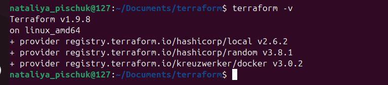  

#### 2. Вносим данные, указанные в документации
```
provider_installation {
  network_mirror {
    url = "https://terraform-mirror.yandexcloud.net/"
    include = ["registry.terraform.io/*/*"]
  }
  direct {
    exclude = ["registry.terraform.io/*/*"]
  }
}
```
#### 3. В папке, в которой будет запускаться Terraform, создаем файл providers.tf с следующим содержанием
```
terraform {
  required_providers {
    yandex = {
      source  = "yandex-cloud/yandex"
      version = "0.141.0"
    }
  }

  required_version = ">=1.8.4"
}

provider "yandex" {
  # token                    = "do not use!!!"
  cloud_id                 = var.cloud_id
  folder_id                = var.folder_id
  zone = "ru-central1-b"
  service_account_key_file = file("~/.authorized_key.json")
}
```
Переменные вынесла в файл variables.tf
#### 4.Создаем файл cloud-init.yml для доступа к облаку, используя сервесный аккаунт Yandex Cloud

```
#cloud-config
users:
  - name: user
    groups: sudo
    shell: /bin/bash
    sudo: ["ALL=(ALL) NOPASSWD:ALL"]
    ssh_authorized_keys:
      - ssh-ed25519 AAAAC3NzaC1lZDI1NTE5AAAAIOlVk5vLOuYAbO0puu4TsKBLxF2EAj37hZor+zIsPHjV nataliya-pischuk@netology
```
#### 5. Проверяем успешную инициализацию в Yandex Cloud
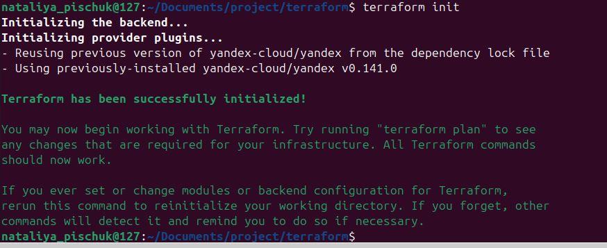

#### 6. Развертываем terraform
Подготавливаем файлы .tf переменных, инфраструктуры (группы доступа, сети).
Перед применением настроек, проверяем корректность
```
terraform plan
```
Запускаем развертку инфраструктуры в Yandex Cloud
```
terraform apply
```
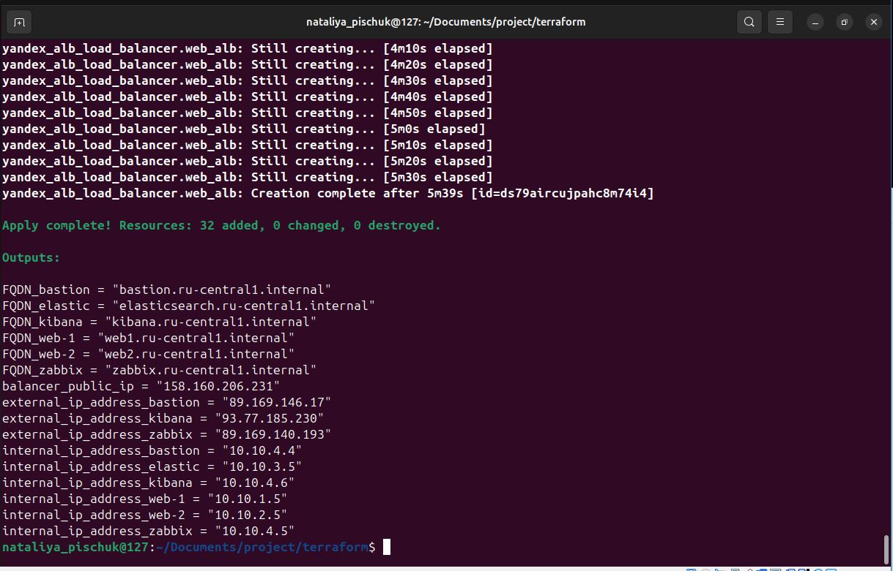
Проверяем созданную инфраструктуру в Yandex Cloud:
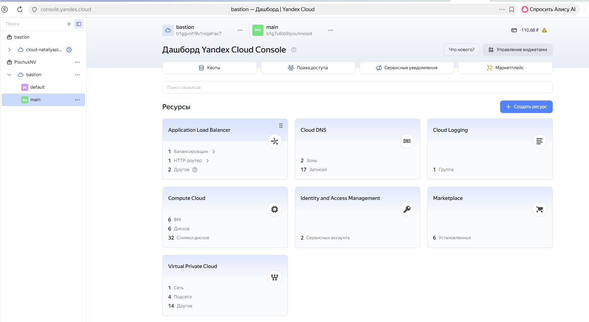
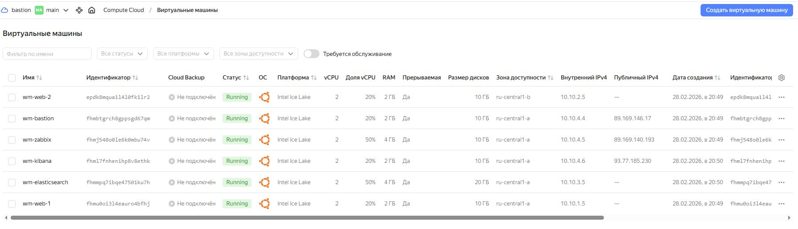

Проверяем наличие снимков и их расписание
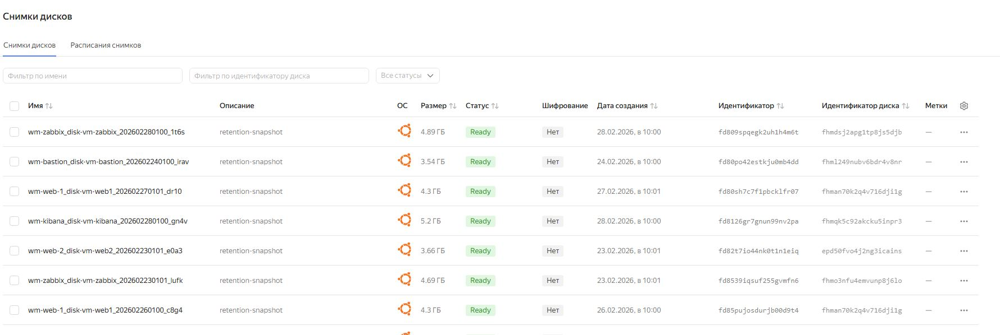
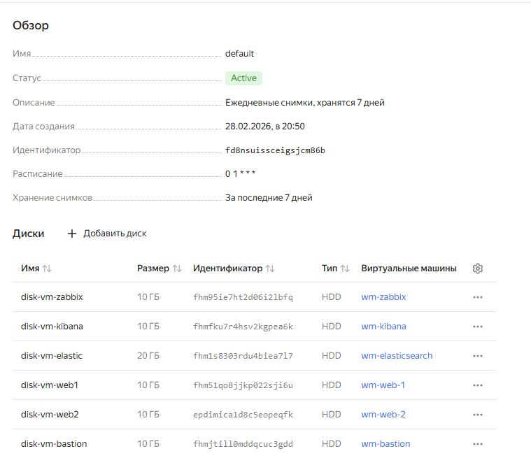

Инфраструктура подготовлена, переходим к настройке виртуальных машин
## Ansible
#### 1. Проверяем установку Ansible
 ```
   ansible --version
   ```
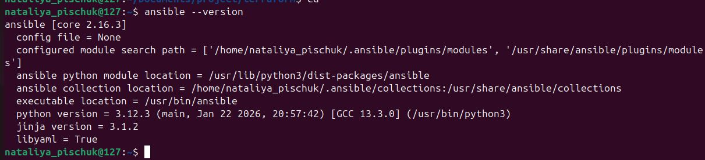

#### 2. Настраиваем ansible на работу через bastion
файл конфигурации ansible.cfg:
```
[defaults]
inventory = ./hosts.ini
host_key_checking = False
```

#### 3. Создаем файл hosts.ini c использованием FQDN имен серверов
```
[all:vars]
ansible_user=user
ansible_ssh_private_key_file=/home/nataliya_pischuk/.ssh/
ansible_ssh_common_args='-o ProxyCommand="ssh -W %h:%p -q user@89.169.146.17"'

[web]
web-1 ansible_host=web1.ru-central1.internal
web-2 ansible_host=web2.ru-central1.internal

[zabbix_server]
zabbix_srv ansible_host=zabbix.ru-central1.internal

[kibana]
kibana_srv ansible_host=kibana.ru-central1.internal

[elasticsearch]
elastic_srv ansible_host=elasticsearch.ru-central1.internal
```

#### 4. Проверяем доступность VM используя модуль ping
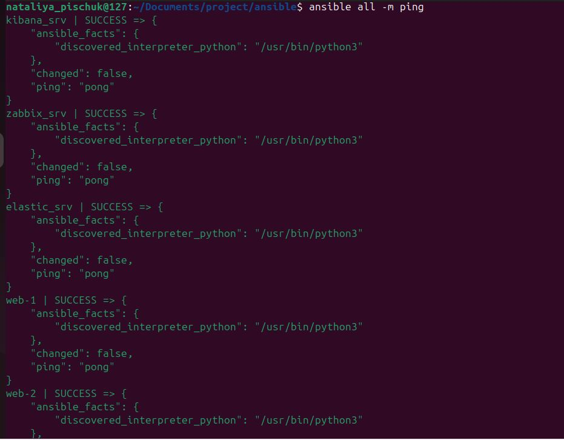

## Устанавка NGINX
```
ANSIBLE_HOST_KEY_CHECKING=False ansible-playbook -i ./hosts.ini nginx.yml 
```
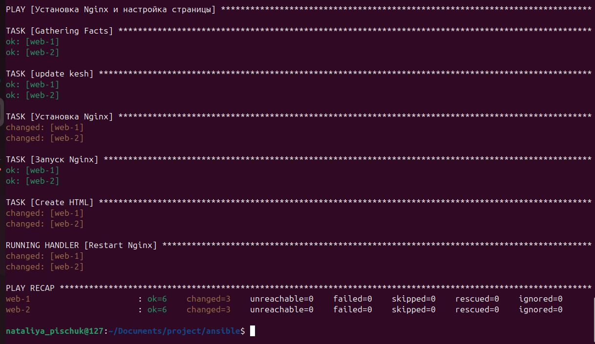

#### Проверяем доступность сайта в браузере по публичному ip адресу Load Balancer
 Обращение к WEB-1
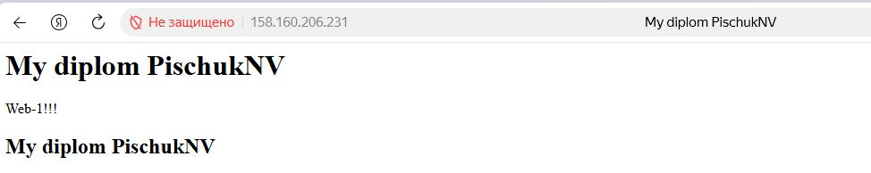

 Обращение к WEB-2
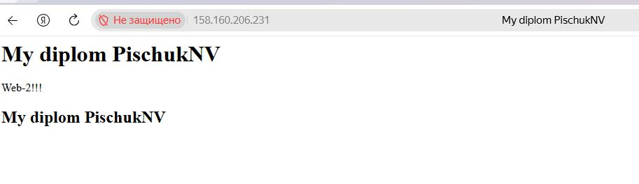
Делаем запрос curl -v
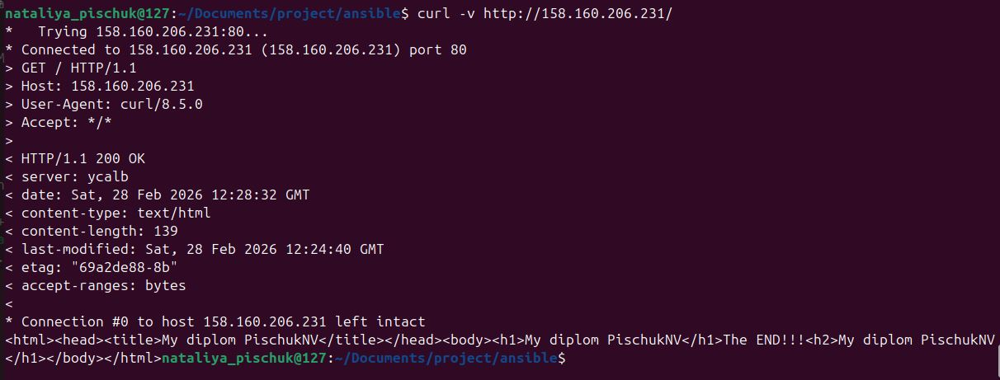

## Мониторинг 
#### 1. Устанавливаем Zabbix сервер
```
ANSIBLE_HOST_KEY_CHECKING=False ansible-playbook -i ./hosts.ini zabbix.yml
```
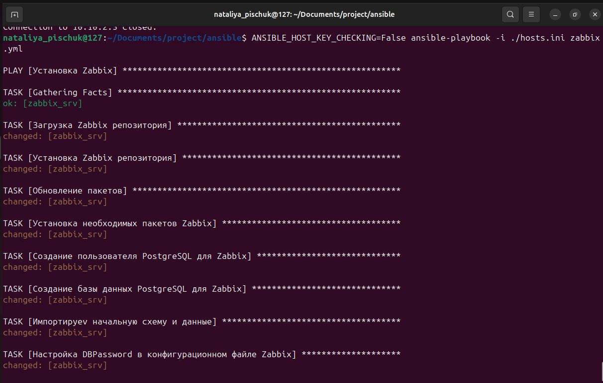

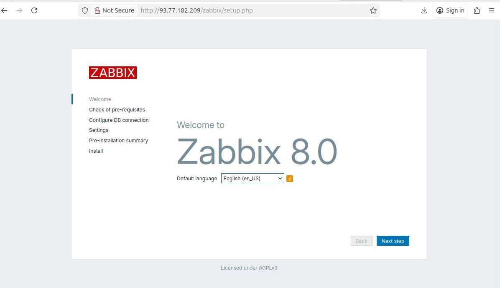

#### 2. Устанавливаем Zabbix агентов на web сервера
   ```
ANSIBLE_HOST_KEY_CHECKING=False ansible-playbook -i ./hosts.ini zabbix_agent.yml 
```
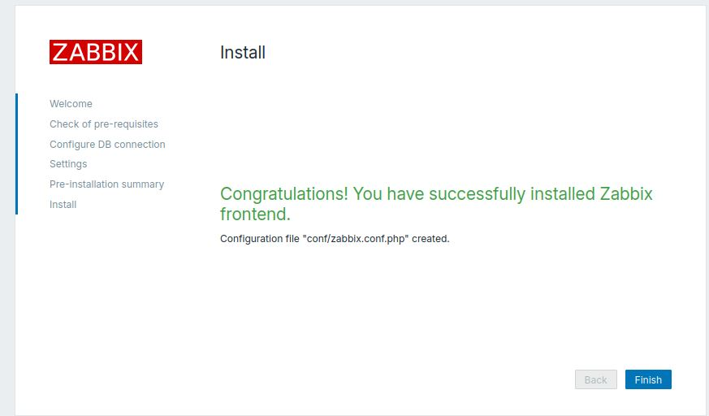

#### 3. Добавляем хосты используя FQDN имена в zabbix сервер и настраиваем дашборды
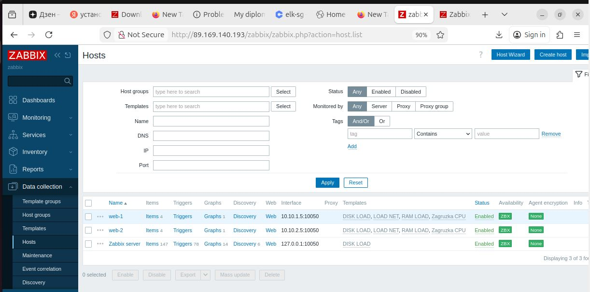

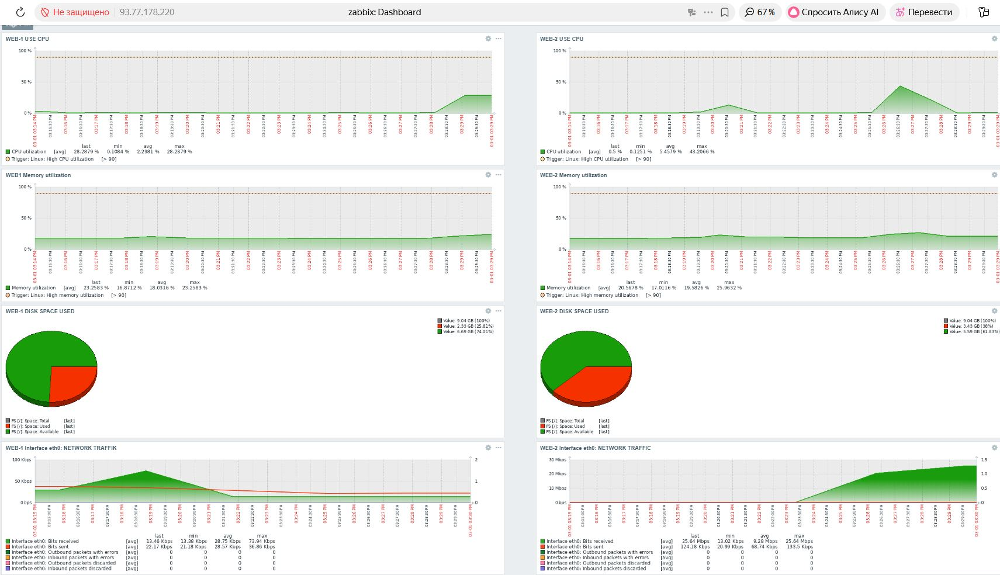

## Устанавлиеваем стек ELK для сбора логов
#### Устанавливаем Elasticsearch
```
ANSIBLE_HOST_KEY_CHECKING=False ansible-playbook -i ./hosts.ini elastic.yml 
```

#### Устанавливаем Kibana
```
ANSIBLE_HOST_KEY_CHECKING=False ansible-playbook -i ./hosts.ini kibana.yml
```
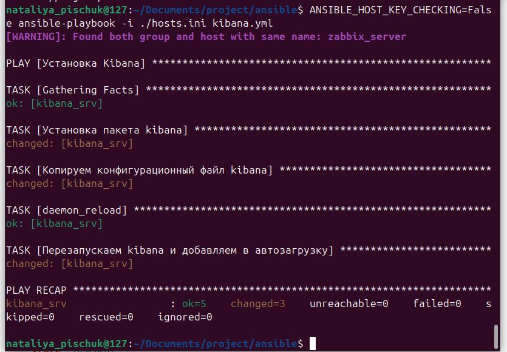
Проверяем, что Kibana работает
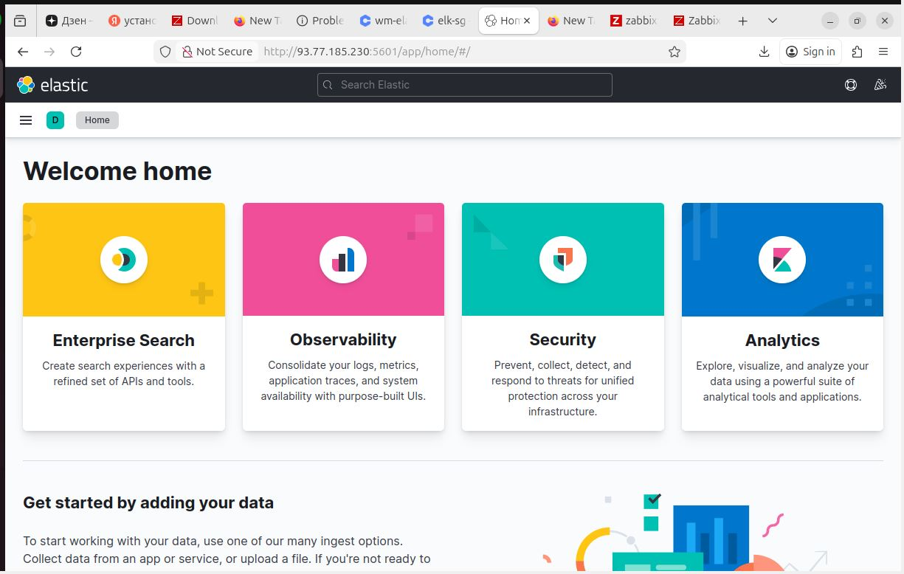

#### Устанавливаем Filebeat на web сервера
```
ANSIBLE_HOST_KEY_CHECKING=False ansible-playbook -i ./hosts.ini filebeat.yml 
```
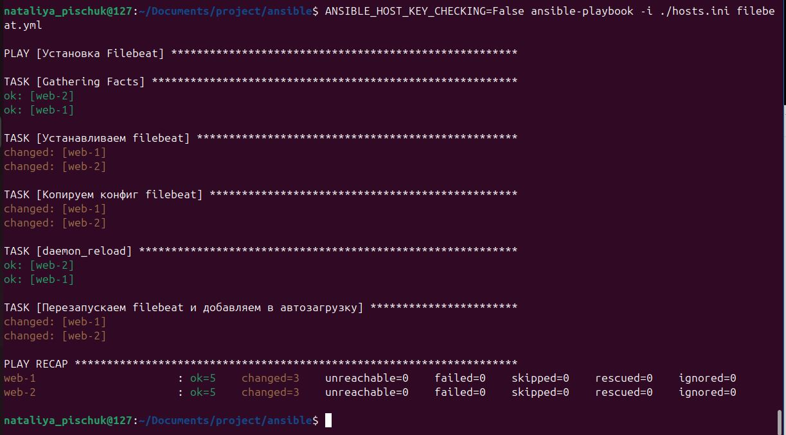

Проверяем в Kibana что Filebeat доставляет логи в Elasticsearch

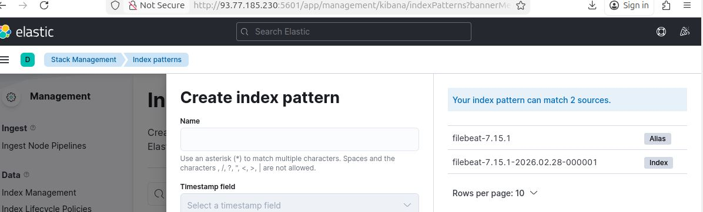
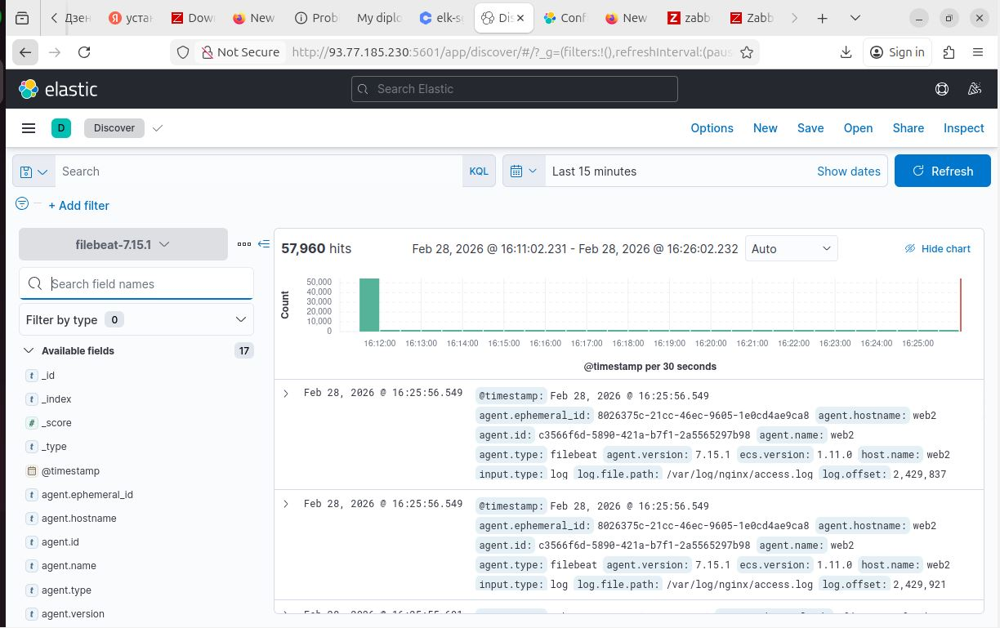

### Выполнение дипломного задания завершено!!!

Актуальные адреса на VM
#### [Балансировщик](http://158.160.206.231/)

#### [Zabbix серевер](http://93.77.191.11/zabbix/)
[Kibana](http://93.77.178.220:5601/app/management/kibana)
